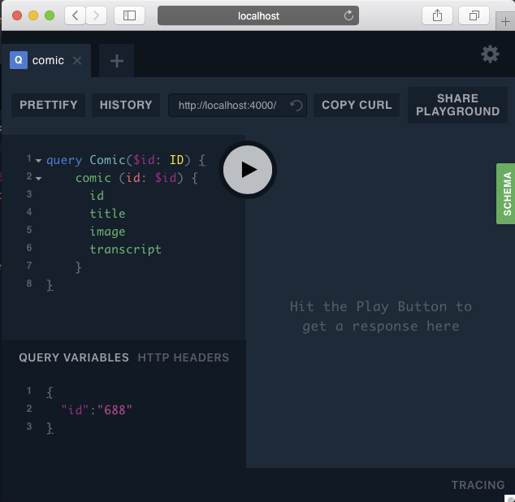

# XKCD Sample

This sample shows you how to build a simple schema to fetch comics from [XKCD](https://xkcd.com).  The sample stands up a simple server that provides a GraphQL interface to the [XKCD REST API](https://xkcd.com/json.html).

The XKCD REST API has a very simple format.  It calls an URL with the ID for the comic that looks like this:

```
https://xkcd.com/688/info.0.json
```

In this case the number `688` indicates that we want to load comic number 688.  The resulting JSON data looks like this:

```javascript
{
	"month": "1",
	"num": 688,
	"link": "",
	"year": "2010",
	"news": "",
	"safe_title": "Self-Description",
	"transcript": "[[There is a pie chart, mostly white with a black slice. The white is labeled \"Fraction of this image which is white.\" The black is labeled \"Fraction of this image which is black.\"]]\n\n[[There is a bar graph labeled \"Amount of black ink by panel.\" Bar 1 is medium height, Bar 2 higher, Bar 3 lowest.]]\n\n[[There is a scatterplot labeled \"Location of black ink in this image.\" It is the positive quarter of a coordinate grid with the zeroes marked. The graph is, of course, the whole comic scaled to fit the axes, including a smaller version of itself in the last panel, etc.]]\n\n{{Title text: The contents of any one panel are dependent on the contents of every panel including itself. The graph of panel dependencies is complete and bidirectional, and each node has a loop. The mouseover text has two hundred and forty-two characters.}}",
	"alt": "The contents of any one panel are dependent on the contents of every panel including itself. The graph of panel dependencies is complete and bidirectional, and each node has a loop. The mouseover text has two hundred and forty-two characters.",
	"img": "https://imgs.xkcd.com/comics/self_description.png",
	"title": "Self-Description",
	"day": "13"
}
```
We can turn this REST API into a GraphQL API with just one file [index.js](index.js).

## Running this sample

To run this sample you first need to install [NodeJS](https://nodejs.org/en/download/) which comes with `npm`.  Go to the root of the graphql-schema-bindings project and run this command:

```
npm install
```

Then switch to the `examples/xkcd` directory and running the following commands:

```
npm install
npm run start
```

When the second command completes go to the following URL with your favorite browser:  [http://localhost:4000](http://localhost:4000).  This will show you the GraphQL playground for our service.  We can use this playground to make queries against our service.

The first step is to enter our query in the upper-left panel like this:

```javascript
query Comic($id: ID) {
  	comic (id: $id) {
    	id
      title  
      image
      transcript
    }
}
```

Then expand the `QUERY VARIABLES` section in the bottom right corner and add a query like this:

```javascript
{
  "id":"688"
}
```

It should look like this:



Now press the play button in the middle of the screen to execute the call.  You should see a response like this:

```javascript
{
  "data": {
    "comic": {
      "id": "688",
      "title": "Self-Description",
      "image": "https://imgs.xkcd.com/comics/self_description.png",
      "transcript": "[[There is a pie chart, mostly white with a black slice. The white is labeled \"Fraction of this image which is white.\" The black is labeled \"Fraction of this image which is black.\"]]\n\n[[There is a bar graph labeled \"Amount of black ink by panel.\" Bar 1 is medium height, Bar 2 higher, Bar 3 lowest.]]\n\n[[There is a scatterplot labeled \"Location of black ink in this image.\" It is the positive quarter of a coordinate grid with the zeroes marked. The graph is, of course, the whole comic scaled to fit the axes, including a smaller version of itself in the last panel, etc.]]\n\n{{Title text: The contents of any one panel are dependent on the contents of every panel including itself. The graph of panel dependencies is complete and bidirectional, and each node has a loop. The mouseover text has two hundred and forty-two characters.}}"
    }
  }
}
```

## How it works

Our sample creates a class called `Comic` to define the comic we are looking for.  It takes an ID of the comic that we're looking for.  We then specify what fields we want back about our comic.  In this case we are asking for the `id` of the comic, the `title` of the comic, the URL to the `image` of the comic, and the `transcript` for the comic which shows a transcript of the text of the comic.  All of these fields are optional.  

### Let's look at the code

All of the code for this sample is in [index.js](index.js).  We start by defining our query like this:

```javascript
@type
class XKCDQuery {
  @field(Comic)
  async comic(@arg(ID) id) {
    const url = id ? `/${id}` : "";
    const { data } = await axios.get(`https://xkcd.com${url}/info.0.json`);
    return new Comic(data);
  }
```

This defines a query for a comic object that takes an `ID` to identify what commit we want.  We also support other queries like `latest` and `random`.

We then define our `Comic` class like this:

```javascript
@type
class Comic {
  /** @type {XKCDQuery} */
  @context
  context;

  @field(ID)
  get id() {
    return this.number;
  }
```

This class uses our decorators to define the types for different fields.  Each field contains a type as part of the decorator for that field.  We can then perform extra business logic to calculate a field like we do in the `date` field:

```javascript
@field(String)
  get date() {
    return new Date(
      this.data.year,
      this.data.month,
      this.data.day
    ).toLocaleDateString();
  }
```